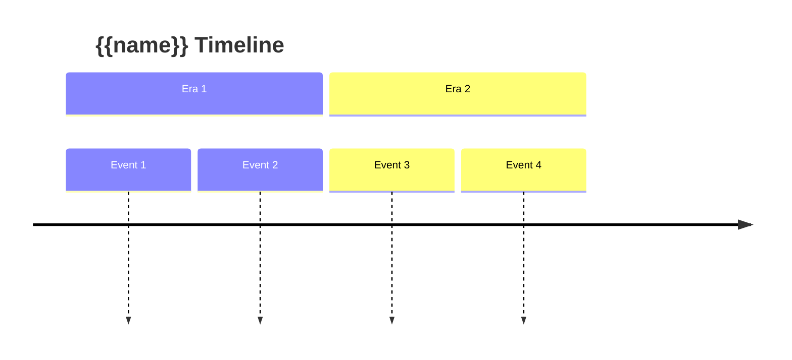

# {{name}}

## Calendar System

### Year Structure

- **Months per Year:**
- **Days per Month:**
- **Days per Week:**
- **Hours per Day:**

### Months

| # | Name | Days | Season | Notes |
|---|------|------|--------|-------|
| 1 |  |  |  |  |
| 2 |  |  |  |  |
| 3 |  |  |  |  |
| 4 |  |  |  |  |
| 5 |  |  |  |  |
| 6 |  |  |  |  |
| 7 |  |  |  |  |
| 8 |  |  |  |  |
| 9 |  |  |  |  |
| 10 |  |  |  |  |
| 11 |  |  |  |  |
| 12 |  |  |  |  |

### Days of the Week

| # | Name |
|---|------|
| 1 |  |
| 2 |  |
| 3 |  |
| 4 |  |
| 5 |  |
| 6 |  |
| 7 |  |

### Moons

| Moon | Cycle | Notes |
|------|-------|-------|
|  |  |  |

## Eras

| Era | Years | Description |
|-----|-------|-------------|
|  |  |  |

## Current Date

- **Era:**
- **Year:**
- **Month:**
- **Day:**

## Holidays & Festivals

| Date | Name | Description |
|------|------|-------------|
|  |  |  |

## Seasons

| Season | Months | Characteristics |
|--------|--------|-----------------|
|  |  |  |

## Timeline

## Notes
