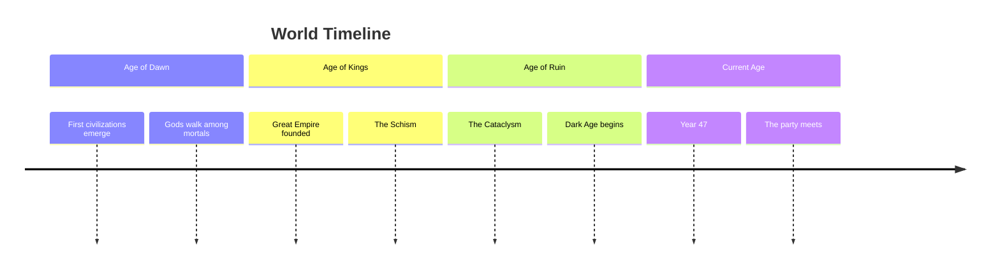

# Custom Calendar Systems

Support for non-standard calendars in worldbuilding vaults.

## Standard Fantasy Calendar

```yaml
months:
  - name: "Frostmere"
    days: 31
    season: "Winter"
  - name: "Stormwatch"
    days: 28
    season: "Winter"
  - name: "Thawbloom"
    days: 31
    season: "Spring"
  - name: "Rainwhisper"
    days: 30
    season: "Spring"
  - name: "Brightmeadow"
    days: 31
    season: "Spring"
  - name: "Suncrest"
    days: 30
    season: "Summer"
  - name: "Heatpeak"
    days: 31
    season: "Summer"
  - name: "Harvestide"
    days: 31
    season: "Summer"
  - name: "Amberfall"
    days: 30
    season: "Autumn"
  - name: "Mistcloak"
    days: 31
    season: "Autumn"
  - name: "Darkhollow"
    days: 30
    season: "Autumn"
  - name: "Deepwinter"
    days: 31
    season: "Winter"
```

## Days of the Week

```yaml
days:
  - "Moonday"
  - "Tidesday"
  - "Windsday"
  - "Thornsday"
  - "Flameday"
  - "Stonday"
  - "Starday"
```

## Eras

```yaml
eras:
  - name: "Age of Dawn"
    start: -5000
    end: -2000
    description: "Before recorded history"
  - name: "Age of Kings"
    start: -2000
    end: -500
    description: "The great empires rose and fell"
  - name: "Age of Ruin"
    start: -500
    end: 0
    description: "The Cataclysm reshaped the world"
  - name: "Current Age"
    start: 0
    end: null
    description: "The present era"
```

## Moon Phases

```yaml
moons:
  - name: "Luna"
    cycle: 28
    phases:
      - "New Moon"
      - "Waxing Crescent"
      - "First Quarter"
      - "Waxing Gibbous"
      - "Full Moon"
      - "Waning Gibbous"
      - "Last Quarter"
      - "Waning Crescent"
  - name: "Celene"
    cycle: 44
    phases:
      - "Dark"
      - "Silver"
      - "Bright"
      - "Full"
```

## Holidays

```yaml
holidays:
  - name: "Midwinter Festival"
    month: 6
    day: 21
    description: "Longest night celebration"
  - name: "Harvest Moon"
    month: 9
    day: 15
    description: "Giving thanks for the harvest"
  - name: "Day of the Dead"
    month: 11
    day: 1
    description: "Honoring ancestors"
```

## Timeline Visualization

Use Mermaid for timeline visualization:



## Integration with Calendarium Plugin

The Calendarium Obsidian plugin supports custom calendars. Configure it with:

1. Install Calendarium from community plugins
2. Create a calendar config file in `_Resources/`
3. Set month names, days, moons, and holidays
4. Events in `06_History_and_Timeline/` with dates will appear on the calendar
